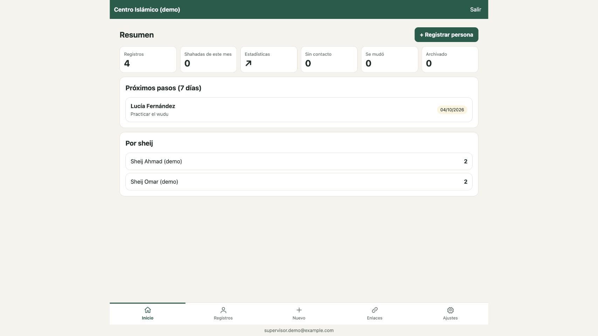
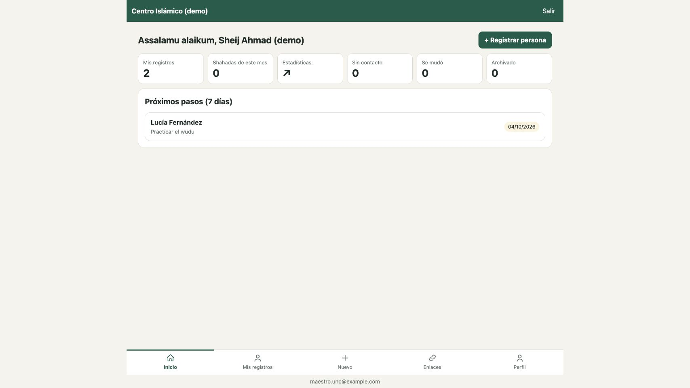
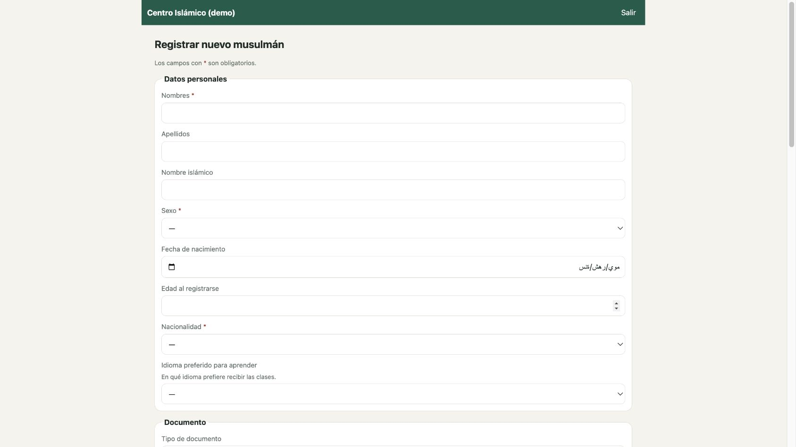

# Guía de uso de Nuevo Musulmán

Esta guía describe las tareas habituales de cada rol. Las capturas se tomaron en la aplicación local con datos ficticios; no contienen registros reales.

## Iniciar sesión e instalar

Ingresá con la cuenta de Google que haya habilitado el supervisor. En una instalación compatible, el navegador permite agregar la aplicación a la pantalla de inicio. La aplicación también ofrece el manifiesto con iconos PNG de 192 y 512 píxeles.

Para probar sin cuentas reales, seguí [`DEPLOY.md`](DEPLOY.md) y usá el modo de prueba local con los usuarios de demostración.

## Supervisor

El supervisor puede ver todos los registros, asignar sheij, corregir datos, revisar registros marcados, administrar catálogos y cuentas, y consultar estadísticas globales.

1. En **Inicio**, consultá los próximos pasos y los recuentos.
2. Abrí **Registros** para buscar por nombre o filtrar por estado, sheij o nacionalidad.
3. Abrí una ficha para editar datos, registrar seguimiento, revisar etapas o emitir una acción disponible.
4. Usá **Ajustes** para administrar listas, cuentas, campos y etapas.

## Sheij / maestro

El sheij ve los registros que tiene asignados. Puede abrir una ficha, actualizar datos permitidos, añadir seguimientos, marcar etapas de aprendizaje y contactar por WhatsApp después de revisar el texto. Si la persona no dio su consentimiento, la aplicación muestra un aviso antes de abrir WhatsApp. Las estadísticas también se limitan a sus registros.

1. En **Mis registros**, buscá una persona asignada.
2. En su ficha, cargá cada contacto con fecha, resumen y próximo paso.
3. Actualizá el avance de aprendizaje cuando completes una etapa.
4. Revisá los datos antes de iniciar una conversación externa.

## Colaborador

El colaborador usa el formulario interno para registrar a una persona. Después de enviar el formulario, no recibe acceso a la ficha ni a otros registros.

1. Completá los datos que conozcas; los campos obligatorios están marcados con un asterisco.
2. Comprobá el consentimiento antes de marcar que acepta contacto por WhatsApp.
3. Adjuntá documentos solo cuando corresponda. Se guardan en privado.
4. Seleccioná **Registrar** una vez revisada la información.

## Privacidad y ayuda

- No compartas enlaces ni capturas que contengan datos reales.
- No escribas en la hoja de respuestas del formulario de Google.
- Si una ficha no aparece, pedí al supervisor que confirme la asignación y el estado de tu cuenta.
- Las capturas de esta guía proceden del entorno local de demostración.
